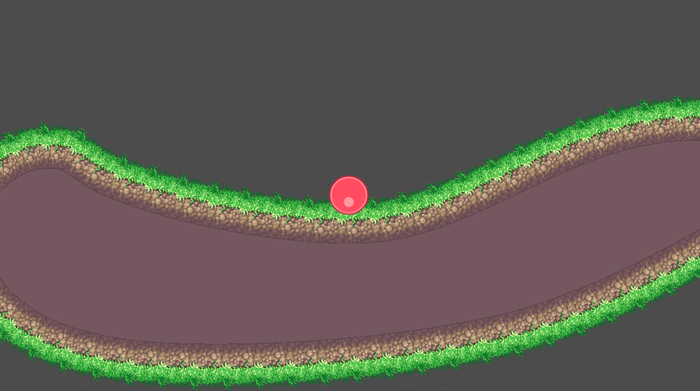

# Dynamic terrain
An example of simple dynamic terraing in Godot 4

`Press A and D to add impulse to the ball.`

It uses a Path2D to define the main path, and syncs it to:
* A CollisionPolygon2D for collision detection
* A Line2D to draw the surface texture
* A Polygon2D to fill the rest of the terrain
