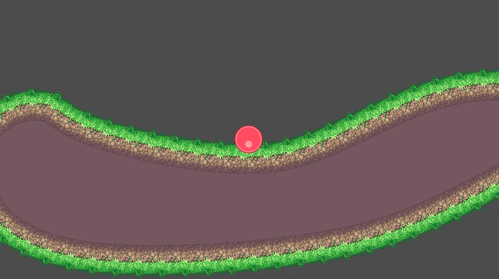
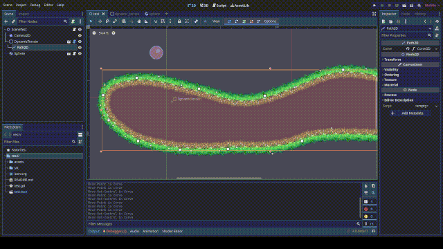

# Dynamic terrain
An example of simple dynamic terraing in Godot 4

`Press A and D to add impulse to the ball.`

It uses a Path2D to define the main path, and syncs it to:
* A CollisionPolygon2D for collision detection
* A Line2D to draw the surface texture
* A Polygon2D to fill the rest of the terrain

Art used:
* Kenney's [Rolling Ball](https://www.kenney.nl/assets/rolling-ball-assets).
* Ansimuz's [Magical Road](https://itch.io/queue/c/394532/sunnyland?game_id=1170564).
